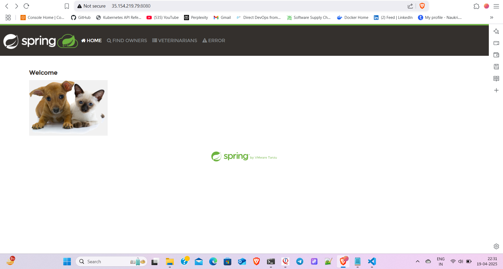
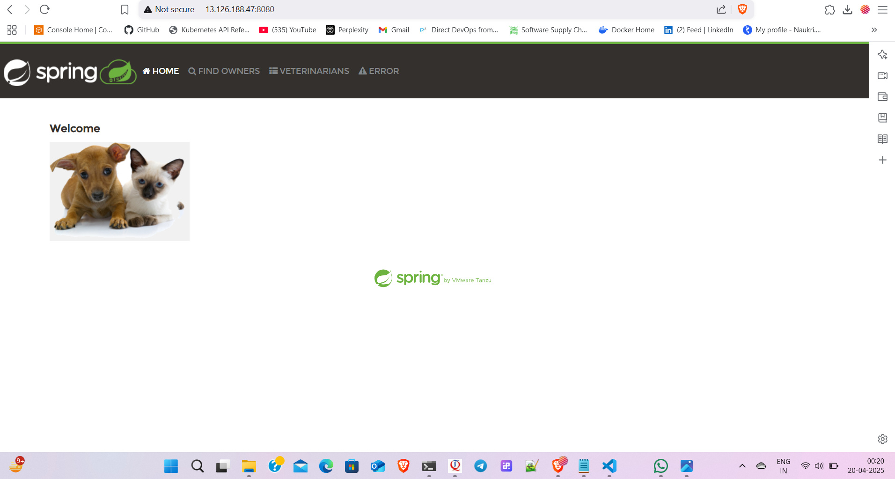

# Spring-Petclinic

* This depicts the manual approach of SPC in ubuntu-24.04 using t2.medium as a vcpu
* After creating the server clone the git repo of SPC as given below

```bash
git clone https://github.com/spring-projects/spring-petclinic.git
cd spring-petclinic
```

* Then download Java -17

```bash
sudo apt update 
sudo apt install openjdk-17-jdk
```

* Then download the maven

```bash
wget https://dlcdn.apache.org/maven/maven-3/3.9.9/binaries/apache-maven-3.9.9-bin.tar.gz
tar xvzf apache-maven-3.9.9-bin.tar.gz
mkdir /opt/maven
sudo mv apache-maven-3.9.9 /opt/maven
Then copy this path to vi editor to setup the maven permission, makesure to keep the colon ":" after the available paths are shown, 
":/opt/maven/apache-maven-3.9.9/bin/"
Then exit and relogin
And then check the version
"mvn --version"
```

* Now "cd spring-petclinic" & apply the below command

```bash
mvn clean package
```

* After building the SPC Project, goto this folder "cd spring-petclinic/target" and then apply this command
  
```bash
java -jar spring-petclinic-3.4.0-SNAPSHOT.jar
```

* After this access with your public ip address

```bash
http://your<publicip>:8080
```



***Note: Make sure that in your ubuntu machine security inbound/outbound rules are open for HTTP & SSH***

## Now using Dockerfile approach

* Take ubuntu-24.04, install docker

```bash
curl -fsSL https://get.docker.com -o install-docker.sh
sh install-docker.sh
```

* Then set the permissions for docker

```bash
sudo usermod -aG docker ubuntu
```

* exit and re-login

* After this fork the Spring-petclinic repository into your github account
* like this it will be shown

```bash
git clone https://github.com/Zeeshanshaikh93/spring-petclinic.git
```

* After this clone your forked repository into your local folder and then write a dockerfile, I'm using Multistage dockerfile for making docker    images cleaner, smaller, and more secure.
* The below is my dockerfile

```bash
FROM maven:3.9-eclipse-temurin-17 AS builder
COPY . /spc
WORKDIR /spc
RUN mvn package -DskipTests

FROM eclipse-temurin:17-jre AS runner
WORKDIR /app
COPY --from=builder /spc/target/spring-petclinic-3.4.0-SNAPSHOT.jar spring-petclinic.jar
EXPOSE 8080
CMD ["java", "-jar", "spring-petclinic.jar"]
```

* Then goto your ubuntu server again clone the forked repository, make sure to fetch the updated details using command "git pull" and then follow the below commands

```bash
docker image build -t spc:1.0 .
```

```bash
docker run -d -p 8080:8080 spc:1.0
```

```bash
docker ps / docker ps -a
```

* At the end access your spring-petclinic from the browser

```bash
http://<your-ec2-public-ip>:8080
```

